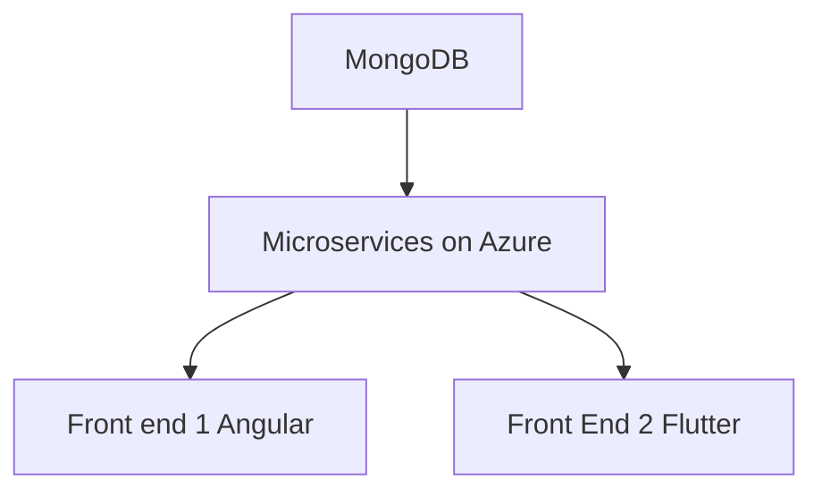

# Sprint 0 Worksheet 
### (in progress)

***
# **Concierge**

Presentation available [here](/Docs/Sprint\ 0/Presentation/Sprint0.pdf)
## Vision Statement:

Concierge is an easy to use hotel administration system which allows guests to communicate with hotel operators from anywhere and provide comprehensive administration tools for hotel employees.

## initial Architecture:

### Description
The database will be Mongodb.\
The backend will be microservices orchestrated by Kubernetes with Python (and maybe C#) webservers.\
The first front end will be for desktop and will utilize Angular 18 and TypeScript.\
The second from end will be for mobile and desktop and will utilize Vue.js and JavaScript.

### Why this will work well:

## Features

**Core features:**
|||
|---|---|
|**Functional Features**|
|1. User Story: |As a hotel manager, I want to maintain profiles for my employees and guests so they can use appropriate services.|
|Acceptance Criteria:||
|2. User Story:| As a hotel guest, I want to easily utilize hotal accomodations to improve my stay.|
|Acceptance Criteria:||
|3. User Story|As hotel staff, I desire to view and respond to guest requests so they can have an optimal stay.|
|Acceptance Criteria:||
|4. User Story:| As a hotel guest, I want to see information about my stay to help me stay orgainized|
|Acceptance Criteria:||
|**Non-functional Features**|
|1. User Story: | As a hotel owner, I want 500 guests to be able to make 1000 requests (cumulative) without loss of access.|
|Acceptance Criteria:||

## Work division:

Each team member will be appointed a '(co-)leader' of each main architectural pillar.
Database, Backend, Pipeline, Repository/Kanban, First Front-end, and Second Front end.
The leader of each piece is not required to create everything for that piece but rather oversee it to ensure development is on time and complete. That is, they will look for missing tests, documentation, and other issues while monitoring progress on that particular area. Each member can work on any part of the software as needed, work division and tracking will be done using a kanban board to ensure balanced distruibution. The board is the source of truth, if there are any discrepancies, the board resolves them.