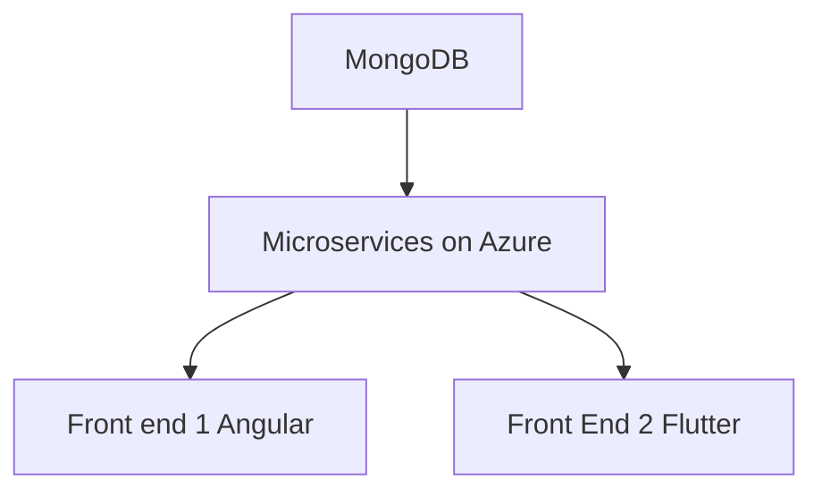

# Sprint 0 Worksheet 

# **Concierge**

Presentation available [here](/Docs/Sprint0/Presentation/Sprint0.pdf)
## Vision Statement:

Concierge is an easy to use hotel administration system which allows guests to communicate with hotel operators from anywhere and provide comprehensive administration tools for hotel employees.

## Initial Architecture:

### Description
The database will be Mongodb.\
The backend will be microservices orchestrated by Kubernetes with Python (and maybe C#) webservers.\
The first front end will be for desktop and will utilize Angular 18 and TypeScript.\
The second from end will be for mobile and desktop and will utilize React and JavaScript.

### Why this will work well:

We chose MongoDB as we have identified it to be more suitable for the objects we will store compared to a SQL based database. Furthermore, it integrates well with our back-end infrastructure allowing us to scale the size as needed. Both Python and C# provide comprehensive web server operability, we will leverage the speed of C# as well as the simplicity of Python to support our end point services. Lastly, to design nice-looking and full-featured front ends we chose Angular/TypeScript and React/JavaScript. Angular will be used for the Desktop focused front end due to its reusable component system and React will be used for the Mobile focused front end for its seamless transition to desktop views.

## Features

### Feature: Task System

| **Key Features** | **User Story**                                                                                                     | **Acceptance Criteria**                                                                                                                                                                                                                            |
|-------------------|-------------------------------------------------------------------------------------------------------------------|-----------------------------------------------------------------------------------------------------------------------------------------------------------------------------------------------------------------------------------------------------|
| Create Tasks (Guest)      | As a hotel guest, I want to create service requests (e.g., room service, extra towels) so that my needs are promptly addressed. | **Scenario:** Guest creates a service request.   Given I’m a guest, when I open the guest task dashboard and choose to create a new service request, I can enter the request details (type of service, description, priority). When I submit the request, it appears in my task list with a status of "pending," and the relevant staff members are notified. |
| View Task Status (Guest)  | As a hotel guest, I want to view the status of my service requests so I can know when my needs will be met.       | **Scenario:** Guest views the status of service requests.   Given I’m a guest, when I open the guest task dashboard, I can see a list of my active requests with their status ("pending," "in progress," "completed").                                  |
| Incomplete Tasks (Staff) | As a hotel staff member, I want to see a list of all incomplete guest requests so I can prioritize my work.      | **Scenario:** Staff views a list of incomplete tasks.   Given I’m a staff member, when I open the staff task dashboard, I can see a list of all incomplete tasks with details such as request type, room number, and priority.                             |
| Claim a Task (Staff)      | As a hotel staff member, I want to claim a task so that I can take responsibility for completing it.              | **Scenario:** Staff claims a task.   Given I’m a staff member, when I open the staff task dashboard and click to claim a task, I am assigned as the responsible staff member, and the task status changes to "in progress."                                      |
| Mark Task Complete (Staff) | As a hotel staff member, I want to mark a task as complete once it's finished so that I can keep my work queue up to date. | **Scenario:** Staff completes a task.   Given I’m a staff member, when I view an existing task I have completed on the staff dashboard, I can click the “Completed” button, and the system updates the task in real-time, giving a confirmation alert.             |

---

### Feature: Accounts

| **Key Features**              | **User Story**                                                                                              | **Acceptance Criteria**                                                                                                                                                                                                                            |
|-------------------------------|-------------------------------------------------------------------------------------------------------------|-----------------------------------------------------------------------------------------------------------------------------------------------------------------------------------------------------------------------------------------------------|
| Login (Staff & Guest)         | As a user, I need to be able to access the tools relevant to me so that I can make use of the system.    | Users can log in with credentials and are directed to role-specific dashboards (guest, staff, manager).                                                                                                                                           |
| Creation (Staff & Room Accounts) | As a hotel manager, I need to be able to give access to guests and employees so they can do their work. | **Scenario:** Creating a new account.   Given I’m a staff member with permission to create accounts, when I fill in the necessary fields for user creation and submit, a new account is created.                                                       |
| Permissions                    | As a manager, I need to be able to restrict access to various tools so that my services remain secure.   | **Scenario:** Editing permissions.   Given I’m a logged-in staff member with permission to edit permissions, when I create a new group, configure its permissions, and assign accounts to it, those accounts gain access to those tools.                   |
| Settings                       | As a user, I want to be able to tailor the tools to my needs so that I can engage with the system as I prefer. | **Scenario:** Modifying preferences.   Given I’m a logged-in staff member, when I update settings (e.g., default dashboard views, notification preferences, initial landing pages), the system saves the changes and reflects them in my next login.         |

---

### Feature: Amenities

| **Key Features**            | **User Story**                                                                                           | **Acceptance Criteria**                                                                                                                                                                                                                            |
|-----------------------------|----------------------------------------------------------------------------------------------------------|-----------------------------------------------------------------------------------------------------------------------------------------------------------------------------------------------------------------------------------------------------|
| View                        | As a guest, I want to access hotel amenity information so I can find out when amenities are available (e.g., the hotel swimming pool is open). | **Scenario:** Guest views hotel amenity information.   Given I’m a guest, when I open the amenities dashboard, I can see a list of amenities offered by the hotel, with operating hours, descriptions, and titles.                                       |
| Create, Update, Delete     | As a staff member, I want to either create, delete, or update hotel amenities so guests are always up to date with our amenity information. | **Scenario:** Staff updates an amenity.   Given I’m a staff member, when I update the amenity details on the staff dashboard and click "Save," the system updates the report in real-time and displays a confirmation message.                                |

---

### Feature: Incident Reports

| **Key Features**            | **User Story**                                                                                           | **Acceptance Criteria**                                                                                                                                                                                                                            |
|-----------------------------|----------------------------------------------------------------------------------------------------------|-----------------------------------------------------------------------------------------------------------------------------------------------------------------------------------------------------------------------------------------------------|
| View                        | As a hotel manager, I want a way to view past and current incident reports created by my staff to better monitor hotel incidents. | **Scenario:** Hotel manager views past and current incident reports.   Given I’m a hotel manager, when I access the incident reports dashboard, I can see a list of past and current incident reports, including details like severity, status, and description. |
| Update                      | As a hotel manager, I want a way to update incident report details as their related case progresses in real-time. | **Scenario:** Hotel manager updates an incident report.   Given I’m a hotel manager, when I update incident details and click “Save,” the system updates the report in real-time and shows a confirmation message.                                          |

---

### Feature: Business Analytics (TRIMMABLE)

| **Key Features**            | **User Story**                                                                                           | **Acceptance Criteria**                                                                                                                                                                                                                            |
|-----------------------------|----------------------------------------------------------------------------------------------------------|-----------------------------------------------------------------------------------------------------------------------------------------------------------------------------------------------------------------------------------------------------|
| —                   | As a staff member, I want to view a guest’s charges incurred during their stay so I can better review and verify them. | —                                                        |

---

### Feature: Booking Service (TRIMMABLE)

| **Key Features**            | **User Story**                                                                                           | **Acceptance Criteria**                                                                                                                                                                                                                            |
|-----------------------------|----------------------------------------------------------------------------------------------------------|-----------------------------------------------------------------------------------------------------------------------------------------------------------------------------------------------------------------------------------------------------|
| See Available Dates, Rooms & Prices | As a guest, I want to check room availability and view pricing details so I can plan and budget my hotel stay. | —                                                                                  |

## Work division:

Each team member will be appointed a '(co-)leader' of each main architectural pillar.
Database, Backend, Pipeline, Repository/Kanban, First Front-end, and Second Front-end.
The leader of each piece is not required to create everything for that piece but rather oversee it to ensure development is on time and complete. That is, they will look for missing tests, documentation, and other issues while monitoring progress on that particular area. Each member can work on any part of the software as needed, work division and tracking will be done using a kanban board to ensure balanced distruibution. The board is the source of truth, if there are any discrepancies, the board resolves them. Additionally, there is an expectation each member will develop a complete feature utilizing the entirety of the tech stack.

