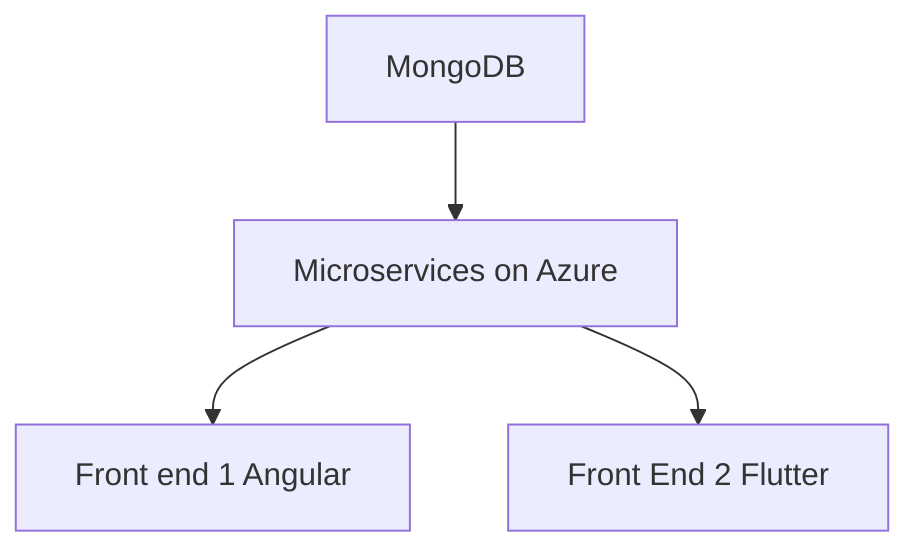

# Sprint 0 Worksheet 

# **Concierge**

Presentation available [here](/Docs/Sprint0/Presentation/Sprint0.pdf)
## Vision Statement:

Concierge is an easy to use hotel administration system which allows guests to communicate with hotel operators from anywhere and provide comprehensive administration tools for hotel employees.

## initial Architecture:

### Description
The database will be Mongodb.\
The backend will be microservices orchestrated by Kubernetes with Python (and maybe C#) webservers.\
The first front end will be for desktop and will utilize Angular 18 and TypeScript.\
The second from end will be for mobile and desktop and will utilize Vue.js and JavaScript.

### Why this will work well:

We chose MongoDB as we have identified it to be more suitable for the objects we will store compared to a SQL based database. Furthermore, it integrates well with our back-end infrastructure allowing us to scale the size as needed. Both Python and C# provide comprehensive web server operability, we will leverage the speed of C# as well as the simplicity of Python to support our end point services. Lastly, to design nice-looking and full-featured front ends we chose Angular/TypeScript and React/JavaScript. Angular will be used for the Desktop focused front end due to its reusable component system and React will be used for the Mobile focused front end for its seamless transition to desktop views.

## Features

**Core features:**

|||
|--|--|
|**Functional Features**|
|1. User Story: |As a hotelier, I want a way for guests to access hotel amenities.|
|Acceptance Criteria:|The guest dashboard should be able to review all available hotel amenity information.|
|2. User Story:| As a hotel guest, I want to request hotel services to improve my stay.|
|Acceptance Criteria:|The guest dashboard should be able to request all available hotel services.|
|3. User Story:|As an employee, I want to be informed of guest requests to efficiently perform my job.|
|Acceptance Criteria:|The employee dashboard shows all appropriate requests.|
|4. User Story:| As a hotel managaer, I want to provide tasks to my employees.|
|Acceptance Criteria:|The manager dashboard should be able to create recurring and one-time employee tasks.|
|**Non-functional Features**|
|1. User Story: | As a hotel owner, I want 500 guests to be able to make 1000 requests (cumulative) without loss of access.|
|Acceptance Criteria:|500 concurrent users should be able to make 1000 cumulative requests without noticible latency (less than one second).|

## Work division:

Each team member will be appointed a '(co-)leader' of each main architectural pillar.
Database, Backend, Pipeline, Repository/Kanban, First Front-end, and Second Front end.
The leader of each piece is not required to create everything for that piece but rather oversee it to ensure development is on time and complete. That is, they will look for missing tests, documentation, and other issues while monitoring progress on that particular area. Each member can work on any part of the software as needed, work division and tracking will be done using a kanban board to ensure balanced distruibution. The board is the source of truth, if there are any discrepancies, the board resolves them.

