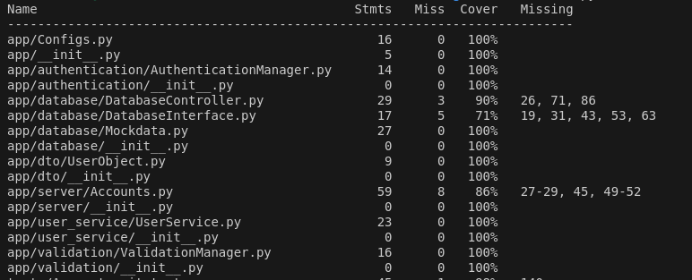
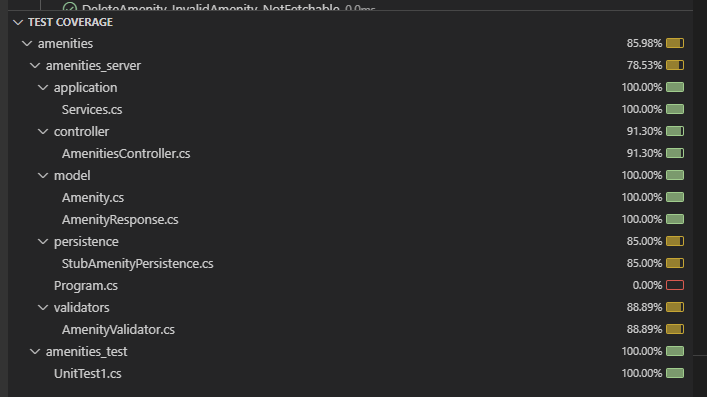

## Testing Plan

[Link to our testing plan](../project_docs/TestingPlan.pdf)

## Coverage:

### Account Service


### Amenities Service


### Incident Report Service


## Most important unit tests:

[Unit Test 1](https://github.com/rainclouded/Concierge/blob/658552c30cd19159889297f31fc4a4a50e678359/src/accounts/tests/ValidationManager_unit_test.py#L101)
 - This test verifies that new users being created meet the username and password criteria. This is important as being able to maintain the user base is a key feature of the app and the code being tested is a major contributor in managing that.
   
[Unit Test 2](https://github.com/rainclouded/Concierge/blob/658552c30cd19159889297f31fc4a4a50e678359/src/accounts/tests/AuthenticationManager_unit_test.py#L163)
 - This test verifies that correct username, password pairs are authenticated successfully. This is important as user accounts need to be secure and this ensures the integrity.

[Unit Test 3](https://vscode.dev/github/rainclouded/Concierge/blob/documentation/sprint1worksheet/82950190/src/amenities/amenities_test/UnitTest1.cs#L158)
 - This test verifies that upon amenity deletion, it is not able to be fetched again for the user. In the context of hotel management, this helps prevent guests from being misled by outdated information, reducing the likelihood of dissatisfaction towards our precious hotel.

## Most important integration tests:
[Integration tests 1](https://github.com/rainclouded/Concierge/blob/main/src/guest_webapp/cypress/e2e/amenities_integration.cy.js)
- This tests the integration between the guest front end and the amenities service. Ensuring that both components work together seamlessly and with no issues.

[Integration tests 2](https://github.com/rainclouded/Concierge/blob/main/src/guest_webapp/cypress/e2e/incident_reports_integration.cy.js)
- This tests the integration between the guest front end and the incident reports service. Ensuring that both components work together seamlessly and with no issues.

[Integration test 3](https://github.com/rainclouded/Concierge/blob/main/src/staff_webapp/cypress/e2e/amenities_integration.cy.ts)
- This tests the integration between the staff front end and the amenities service. Ensuring that both components work together seamlessly and with no issues.

## Most important acceptance tests:
[Acceptance Test 1](https://github.com/rainclouded/Concierge/blob/main/src/guest_webapp/cypress/e2e/amenities_integration.cy.js)
- This tests that users are able to view all amenities that the hotel has to offer. Contributing to our vision that guests should have an easy way to access up-to-date hotel information.

[Acceptance Test 2](https://github.com/rainclouded/Concierge/blob/main/src/guest_webapp/cypress/e2e/incident_reports_integration.cy.js)
- This tests that users are able to submit a incident report to our system. Satisfying our requirement that guests can report to staff when they see something worth reporting in our hotel property.

[Acceptance Test 3](https://github.com/rainclouded/Concierge/blob/main/src/staff_webapp/cypress/e2e/amenities_integration.cy.ts)
- This tests that staff are able to create,update,delete hotel amenities. Satisfying our requirement that staff should be able to keep guests updated on changes to our amenity services whenever it happens.


## Running team 7's project:

1. Was the documentation clear enough to run their software locally (dev environment)? Did you get it running? Now long did it take, was it hard?

The documentation was clear enough to run the software. The desktop front end and the back end (ignoring download times) were set up within 10 minutes. However, the flutter front end required a Mac (this was indicated in the documentation) in order to run the front end. Due to the architecture restriction, I was unable to view this front end environment. Overall, the components which were successfullly run was quick and easy. 

Below is an image of the working front end:


2. Could you run the unit tests ? Did they all work? What about integration tests and other tests?

There was an attempt to run the unit and integraton tests. The front end unit test ran successfully.There were no integration tests but the Readme referred to manual testing, this was successful. Screenshots of such tests are below:


For the back end, the unit tests failed. After retrying the ```npm install```. The tests still failed with the error below:


For the back end integration tests, these failed as well. The error message was similar as seen here:


There was no attempt to run the flutter front end tests, due to the architecture restriction mentioned above.

3. Was there any issues you found when running the software? Connection issues, other problems, especially with it being a distributed system.

There were no connection issues as everything was run locally. The main issue as identified is the mobile front end required specific architecture as well as proprietary software and large downloads. This was definitley an issue in fully testing the software. However the backend was very easy to set up (as long as npm is already installed) and the front end was very easy to set  up and was very easy to use. The implemented features were nicely presented and the non-implemented features presented the user with a nice messageinstead of breaking. Very nice work and design.

