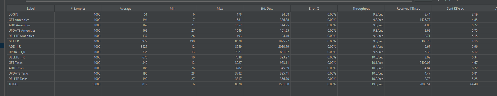
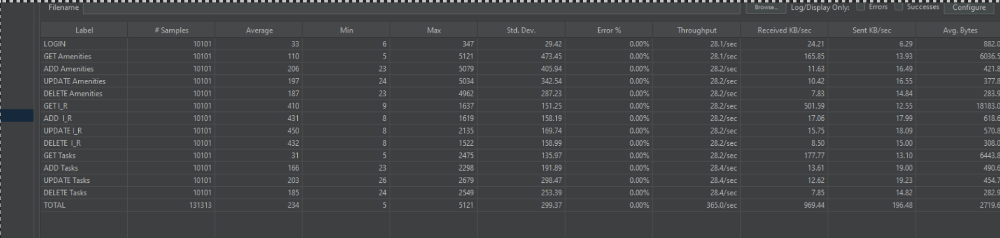
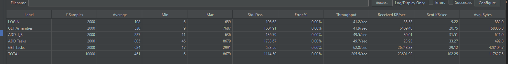
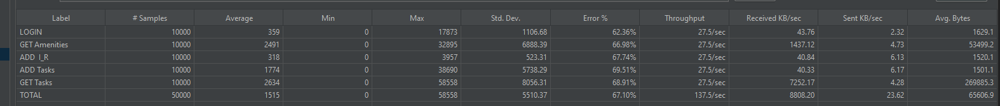
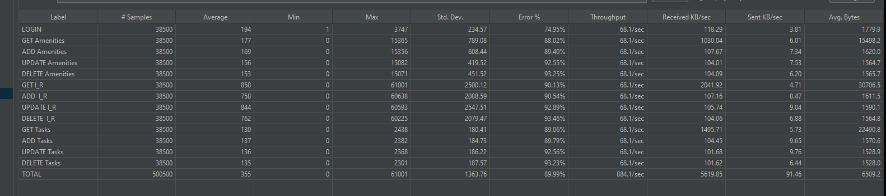
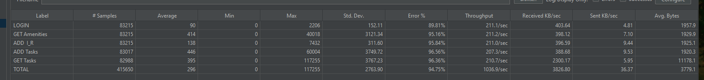

## Load Testing

[Link to our JMeter testing file](./jmeter/Concierge.jmx)

### Environment
For our load testing, we will be using JMeter, and our test cases will be the following: 

#### Scenario 1: Staff member uses all staff functionalities of Concierge 

1. Login to Concierge 

2. Get all amenities 

3. Add a new amenity 

4. Edit amenity 

5. Delete amenity 

6. Get all incident reports 

7. Add an incident report 

8. Edit incident report 

9. Delete incident report 

10. Get all tasks 

11. Add a task 

12. Edit a task 

13. Delete a task 

#### Scenario 2: Guest member uses all guest functionalities of Concierge 

1. Login 

2. Get all amenities 

3. Submit incident report 

4. Submit a task 

5. View all tasks under specified guest 

### Test Reports
#### Scenario 1: 100 staff members concurrently making 130 requests each. 

#### Scenario 1: 500 staff members concurrently making 130 requests each. 

#### Scenario 2: 100 guests concurrently making 100 requests each. 

#### Scenario 2: 500 guests concurrently making 100 requests each. 

### Bottlenecks
Some of the bottlenecks we identified are the GET and ADD endpoints for amenities, tasks and incident reports. We found as more and more of these amenities/tasks/incident reports are being added to the system concurrently, it slowed down the corresponding endpoints due to the sheer amount being added and the size to retrieve and send to the client. But as we followed a microservice architecture, these bottlenecks only impacted their corresponding service. One possible bottleneck could also have been our nginx container, as all requests must pass through nginx to be able to be routed to it's appropriate microservice, this acts as a single point of failure for our service.

### Testing Our Non-Functional Requirement
Our non-functional requirement: 500 users are able to make 1000 concurrent requests, here are the results as follows:

#### 500 staff members concurrently making 1001 requests each. 

#### 500 guests concurrently making 1000 requests each. 

As shown in our test results, we could not meet our non-functional requirement. The sheer amount of concurrent users and their numerous requests proved to much for Concierge to handle. With enough money, we could maybe delegate our software to a third party service such as AWS to handle such a feat, but perhaps improvements could be made to our system to better handle such situations by improving overall efficiency. 

## Security Analysis 
We used [Semgrep](https://github.com/semgrep/semgrep) as our security analysis tool and we run it in our CI/CD pipeline. We chose it because it has multi language support, pre-defined security rules, and can be used in the github pipeline. The tool supported all of our languages including C#, Python, Go, JSON, Markdown, TypeScript, and Javascript. 

 

5 Problems all available in the report below: 

   src/accounts/integration_tests/tests.json 

           ❯❯❱ generic.secrets.security.detected-jwt-token.detected-jwt-token 

           This issue stems from a jwt token hardcoded in our tests. This is not a problem for us as it is a testing value put here intentionally. To deal with this, we ignore scanning the file. 

   src/api_help/redoc-static.html 

            ❯❱ html.security.audit.missing-integrity.missing-integrity 

          This is an issue with an html file which retrieves data from a cdn without verifying the integrity. We do not need to fix this and ignore the file as it is an autogenerated file provided by our api documentation generator. 

    src/guest_webapp/Dockerfile 

                 ❯❯❱ dockerfile.security.missing-user.missing-user 

               This issue appears in multiple places, we were using docker files but were not specifying non-root accounts to run the commands which could be problematic. For all except 2 instances of this issue, we created a non-root user and used it to run the commands. 

src/permissions/README.md 

             ❯❯❱ generic.secrets.security.detected-private-key.detected-private-key 

           The tool identified a Private key left in one of our readmes. This is ok as it is there as an example, this key should not actually be used in production. The issue was handled by ignoring markdown files. 

       e.  src/incident_reports/incident_reports_server/controllers 

            ❯❱ python.flask.security.audit.debug-enabled.debug-enabled 

           Our python api endpoints are hosted using flask and we have debug enabled on it which is being flagged. Flask should not be used in production and this is not a critical issue so we just left it. 

[Report](https://github.com/rainclouded/Concierge/actions/runs/12190297567/artifacts/2282436455)  

 

One of the initial reports were 

 

Pr where fixes were merged [here](https://github.com/rainclouded/Concierge/pull/248/files#diff-631f97bc8b38f9e2b921fe9b8ebf9f810f805cc64a779f183407ba4056312910) 

There are two outstanding critical vulnerabilities which will not be addressed. The are with regards to the docker files both of our front ends using Superuser privileges. The way which we designed our nginx config for the front end, such privileges are necessary and will not be fixed. (Potential technical debt)  

## CI/CD Pipeline: 
1. 

We did not have just one file for our CI/CD pipeline. We used 7 files in our pipeline available [here](https://github.com/rainclouded/Concierge/tree/main/.github/workflows). The actual runs can be viewed [here](https://github.com/rainclouded/Concierge/actions). 

2. 

[Here]() is the snapshot of a run which verifies our docker builds successfully. 

 

[Here]() is the snapshot of a run pushes our docker images to dockerhub. 

## Thoughts
There are two main changes which we would make if we could change our project. The first is the usage of Flask to manage API requests in our python services. We did not know when we began the project that Flask is not intended to be used for production applications and we ended up designing some of our microservices around it. It is sufficient for our development and we have had no problems with our services which use it; but, if we could change the architecture we would go with a more robust framework like Django instead. 

The second part we would change is our lack of integration with third-party services. We built all of our application without using any third-party services in the actual product so we were unable to gain the experience which comes from doing so. Not only would it be an excellent learning experience, using these services would provide a fast way to develop and deploy new features and such speed could have been leveraged in our existing architecture to reduce manual labour on some tasks and speed up project progression. 

## Other Thoughts
We would have liked to add more requirements/features to the project. One suggestion which was made was the capability for administrators manage room bookings. This could have been a core feature but was not added due to time constraints. Another potential change would be to have more pair programming. It is great experience to pair program as all parties are able to learn and discuss problems but because of scheduling conflicts and general business, not a lot of pair programming was achieved. 
