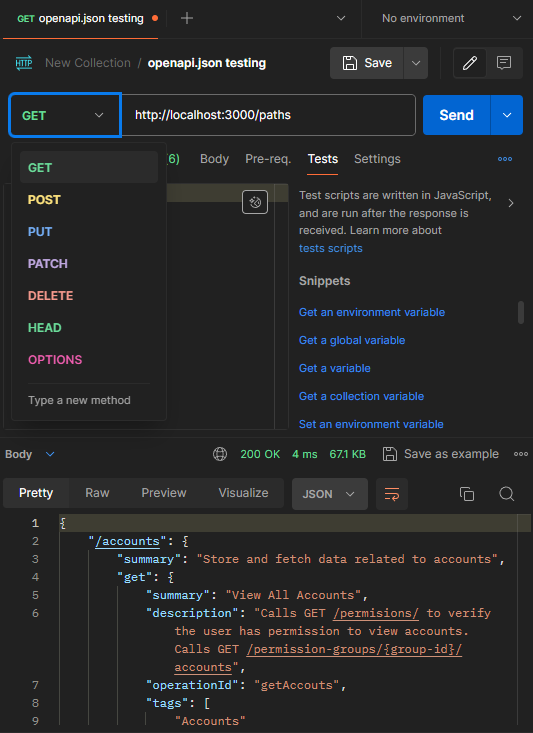

# API documentation
#### *Requirement*
- [Node](https://nodejs.org/en)
- redocly `npm i -g @redocly/cli@latest`
- json-sever `npm i -g json-server`

#### How to run

- Navigate to `../Concierge/src/api-help`
- To compile redoc-static.html, run `npx @redocly/cli build-docs openapi.json`
- Open `redoc-static.html` to view api documentation
- Run `json-server --watch openapi.json`
- Open http://localhost:3000/

#### Test API with Postman
- Simply create new request `GET, POST, PUT, DELETE` with URL http://localhost:3000/
- Exmample:

## Convention
- openapi is a common standard for storing api data, we are not tied to redoc to render the webpage.
